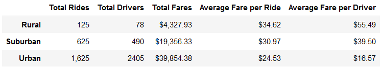
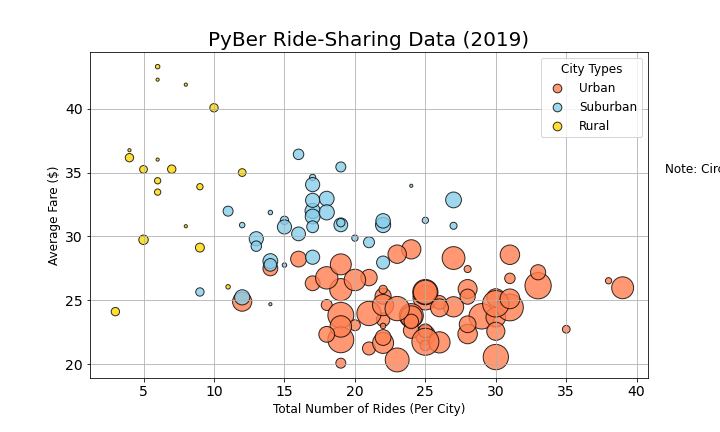
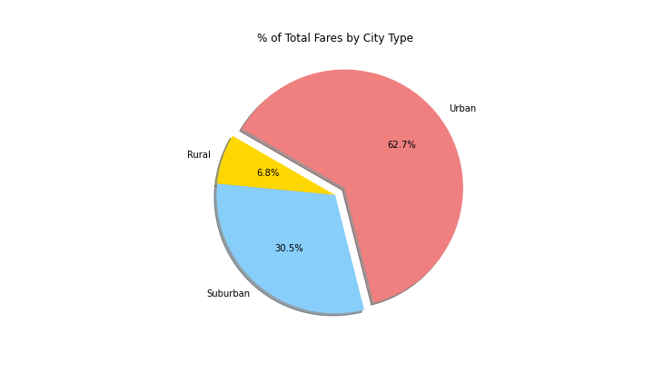
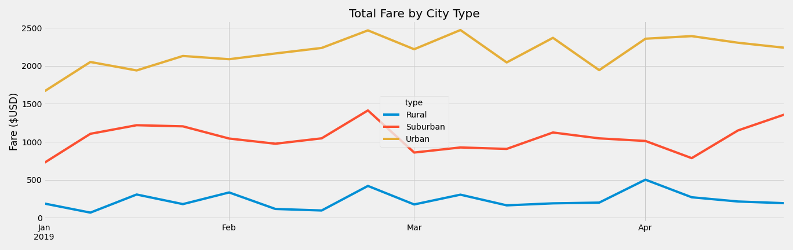

# PyBer_Analysis

## Overview
This report will evaluate the ride-sharing differences between city types.

## Resources
Data Sources: city_data.csv, ride_data.csv
## Purpose
The purpose of this report is to provide detailed information, about the performance of ride-sharing in different city types, to decision-makers at PyBer.

## Analysis
We need to understand the differences in ride-sharing outcomes for each city type. When we combine the city data with the ride data we can see how number of ride, number of drivers and fares reflect for each city type.

Looking at the summary above the picture begins to come into view. From a monetary stand point, the Average Fare per Ride and the Average Fare per Driver are both highest for the Rural cities, but the highest Total Fares happen in Urban cities.

### Taking a deeper dive into the data.
If we plot the Average Fares per Ride against the Total Rides per city, with a focus on Total Drivers the picture gets a little clearer.

We can see that the Urban data, though at a lower Average Fare, has more representation on the plot.

### Let's take a look at the percentages
If we consider the Totals by the percentages for each city type...

 |  | 

We can now see why the Totals for the Urban data are much larger that Suburban and Rural.

### Let's verify the consistency by viewing the data over time

We can now see that even though the Rural averages are considerably higher than both the Urban and Suburban, they don't come close in terms of revenue. 

## Summary
When considering new markets, the size of the market should effect the strategy employed. Smaller markets are less competitive, which allow for higher per ride and per driver rates. Suburban markets are more competitive that Rural, which will require lower rates per ride. Where Urban markets are much more competitive and require even lower per ride fares, which result in lower per driver fares, but the higher number of rides will ultimately generate more revenue.